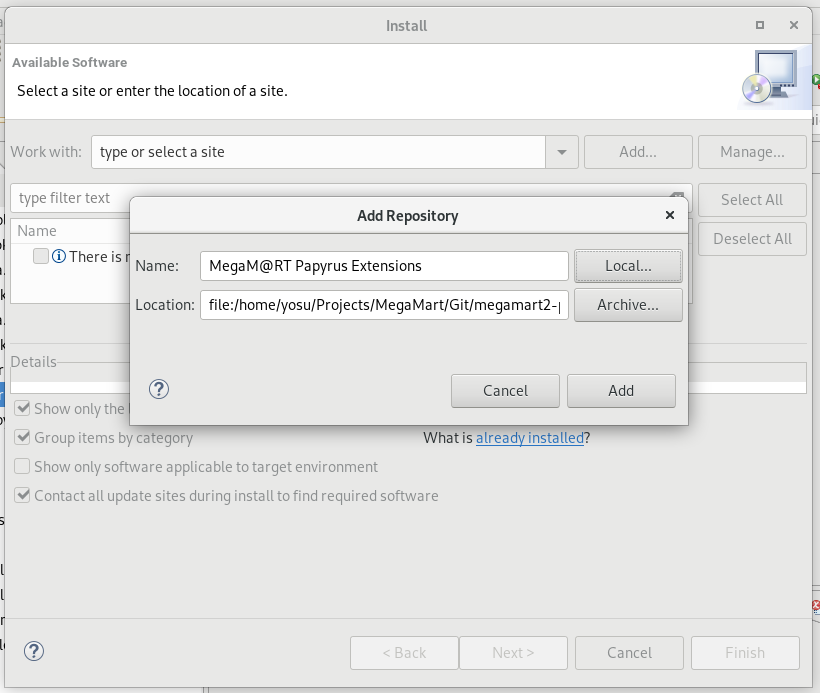
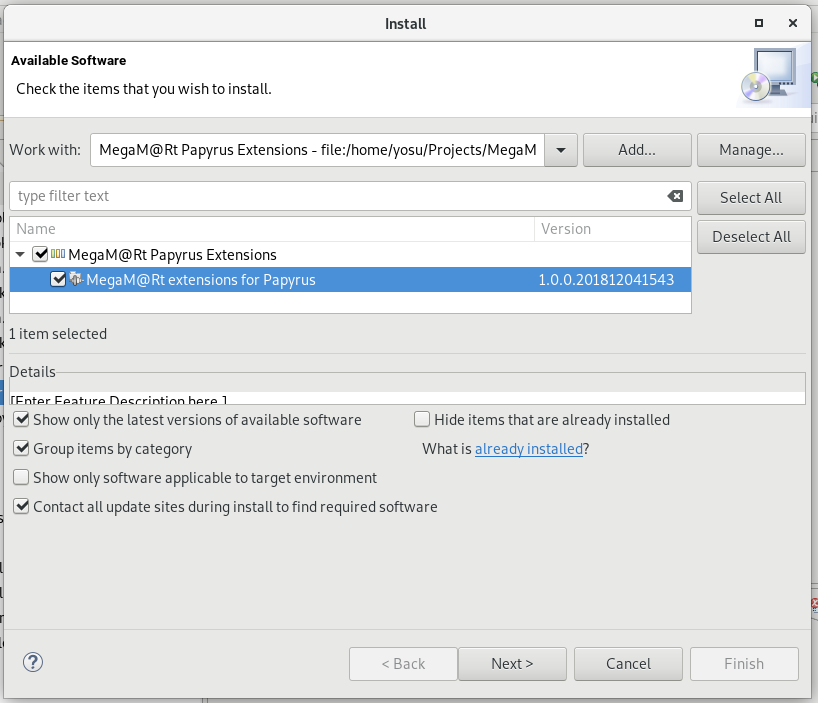
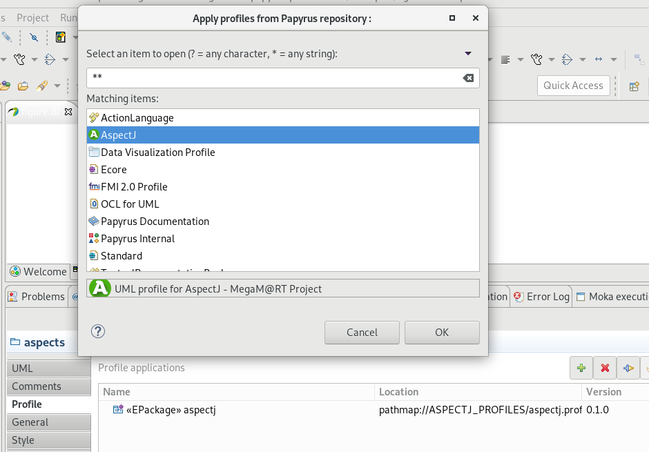
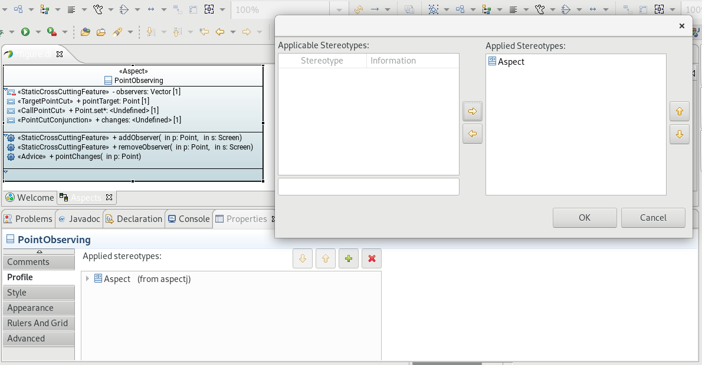
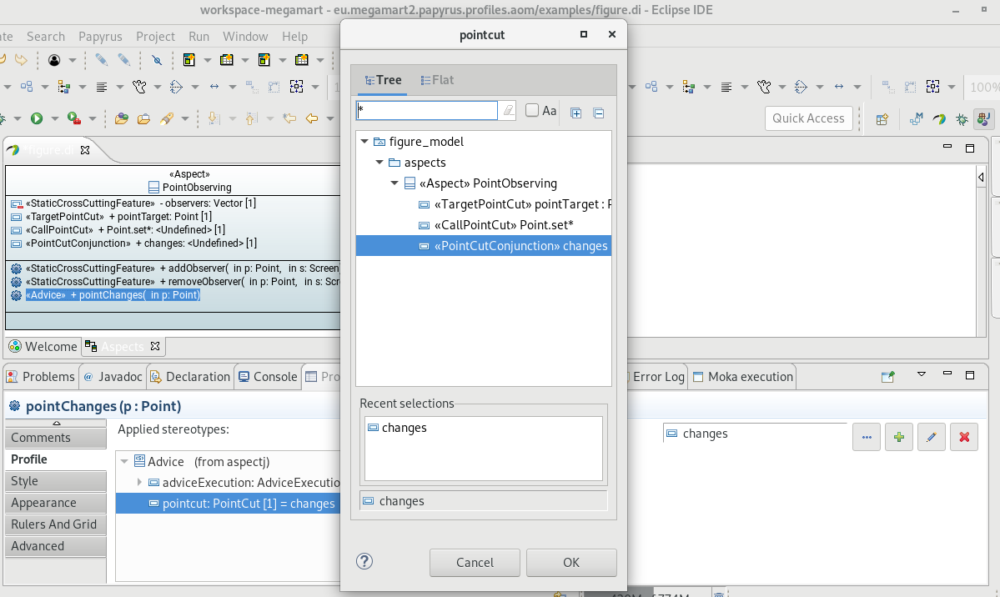

#  MegaM@Rt project: Papyrus Extensions

This repository contains the code of number of plugins that extend the functionality of Papyrus for Aspect Oriented Modeling (AOM). It also contains an update site to install them.

## MegaM@Rt Extensions for Papyrus

- eu.megamart2.papyrus.profiles.aom: this extension adds a AspectJ profile that enables the modeling of AspectJ applications and aspects.

## Installation
The installation of the MegaM@Rt Extensions for Papyrus follows the standard Eclipse plugin installation precedure.

### Requirements
MegaM@Rt Extensions for Papyrus require the following software requirements:
- Git
- Eclipse 2018-09 Modeling (or above)
- Papyrus

Install Git, Eclipse 2018-09 Modeling, Papyrus before proceedding to install these Papyrus extensions. 

### Installation precedure
1. In a command line interface (CMI), pull the **MegaM@Rt Extensions for Papyrus Repository** to get the update site locally:
`git clone https://gitlab.atosresearch.eu/ari/megamart2-papyrus.git`
This will create a *megamart2-papyrus* folder into your local file system

2. In Eclipse, select the top-menu Help/Install New Software. In the Install Wizard, select the Add... button to create a new local repository. Give a name and select the Local... button. Browse your local file system to the Git repository created in previous step. Select the *megamart2-papyrus/Site/eu.megamart2.papyrus.extensions.site* folder

3. In Install wizard, select the *MegaM@Rt Extension for Moka* feature, and click on next. Follow next steps, acepting the license and finish. Accept new popup windows that may appear to accept the installation. Restart Eclipse when prompted.

## User Manual

## Modeling AspectJ in UML with AspectJ profile

The *MegaM@Rt AspectJ* profile can be apply to model aspects and pointcut/jointpoints for software systems modelled with UML. Following procedure describes how to use the profile in Papyrus UML Editor. As an example, we use the *figure.uml* model shipped within the clonned local repository *megamart2-papyrus* in the location *megamart2-papyrus/Plugins/eu.megamark2.papyrus.profiles.aom/examples*. This figure model is borrowed from [AspectJ documentation](https://www.eclipse.org/aspectj/doc/next/progguide/printable.html#starting-aspectj)

1. Open *figure.pi* by double-clicking
2. In the *welcome* tab open both the *figures* and *aspect* model views by double-clicking on them

3. On *aspect* view, click on any blank part of the model. Open the *properties* view. Select the *profile* tab. The *aspectj* profile is already applied. To apply this (or another profile) to the model, click on the *apply registered profile* icon and select **AspectJ** profile from the list. Once accepted, the profile is added to the list of applied profiles

4. To apply an AspectJ stereotype to a property or operation of the *PointObserving* aspect, select the element in the Papyrus model view. Then, in the properties view, select the *profile* tab. Click on the *green plus* icon to add an stereotype. Select the stereotype from the list and click on add *right pointing arrow* button to move the profile for the list of *applicable stereotypes* to the list of *applied stereotypes*. Accept the dialog. The new stereotype appears in the list of *applied stereotypes* in the *profile* tab.

5. Edit the stereotypes properties (slots) and reference them to other compatible stereotyped elements within the model (e.g. the <<aspect>> *PointObserving* class).

 

**AspectJ** profile is based on the published research work:
*Evermann, J. (2007, March). A meta-level specification and profile for AspectJ in UML. In Proceedings of the 10th international workshop on Aspect-oriented modeling (pp. 21-27). ACM.*. 
Consult this work as a reference for the semantics of the AspectJ profile.

Main contact: Jesús Gorroñogoitia <jesus.gorronogoitia@atos.net>

